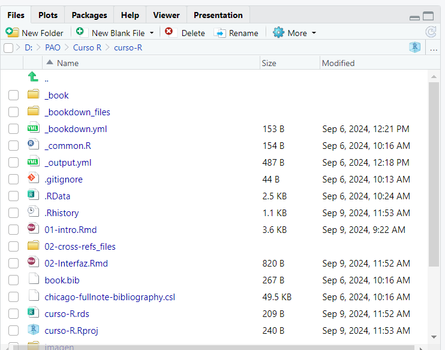

# Interfaz de RStudio

* **Consola: ** En la consola podemos ejecutar órdenes y también es la sección en donde se mostrarán los resultados. 

```{r consola, echo = FALSE, out.width = "75%", fig.align = "center", fig.asp=.75,fig.cap='Consola de R'} 
knitr::include_graphics("./imagen/consola.png")
```

* **Entorno de variables: ** Si observas la imagen anterior, se ha utilizado la consola como una calculadora, sin embargo, implicitamente hemos realizado un proceso muy importante en la programación, **la asiganción**, que consiste en almacenar un valor en una variable, cuando se asigna una variable  se realiza una reserva de memoria.

Para realizar una asignación en `R` se debe tener en cuenta tres elementos:

1. El nombre de la variable
2. El operador de asignación que puede ser: <- o =
3. El datos a asignar

Practiquemos, en la consola escribiremos:

```{r, eval=FALSE}
a <- 30
b = 12
```


¿Pero en donde puedo visulaizar las variables que hemos creado? 
El panel de entorno es en donde se irán guardando los objetos con los que trabajemos.

```{r entorno, echo = FALSE, out.width = "75%", fig.align = "center", fig.asp=.75,fig.cap='Entorno de R'} 
knitr::include_graphics("./imagen/entorno.png")
```

* **Archivos/Plots/Ayuda: ** Este cuadrante se encuentra en la parte inferior derecha de la pantalla y tiene varios paneles, entre ellos tenemos la pestaña `Files` en donde se muestran los documentos del directorio del proyecto en donde se está trabajando actualmente. En el panel también se tiene las pestañas: `Plots` en donde se mostrarán los gráficos resultantes, `Packages` los paquetes instalados, `Hepl`en donde se podrá busrcar la documentación de las funciones.

```{r Archivos, echo = FALSE, out.width = "75%", fig.align = "center", fig.asp=.75,fig.cap='Panel de Archivos de R'} 

```

Además si se escribe en la consola `? Nombre de la función` se activará el panel de ayuda con la información de la función 

```{r, eval=FALSE}
? read.csv
```

```{r ayuda, echo = FALSE, out.width = "75%", fig.align = "center", fig.asp=.75,fig.cap='Panel de Ayuda'} 
knitr::include_graphics("./imagen/ayuda.png")
```

## ¿ Y En dónde Programamos?

Recordemos que cuando hablábamos de RStudio, hacíamos el simil con el canal de comunicación, por lo que la última parte del interfaz que nos falta revisar es justamente en donde vamos a progamar. Así que abriremos un Script. Un **Script** no es más que un archivo de texto en el que se escribe las intrucciones para comunicarnos con R.

¿Podríamos comunicarnos a través de la consola? **Si** sin embargo cuando cierres RStudio, perderás todo. 

* **Vamos a abrir nuestro primer Script** haciendo click en `File<< New File<< R Script` Tras abrirlo se desplegará una cuarta ventana en donde empezaremos a trabajar. Recuerda que este archivo se puede guardar tecleando `Ctrl + s` o haciendo click en `Save current Documents`

```{r script, echo = FALSE, out.width = "75%", fig.align = "center", fig.asp=.75,fig.cap='Apertura de Script'} 
knitr::include_graphics("./imagen/script.png")
```

```{r scriptp2, echo = FALSE, out.width = "75%", fig.align = "center", fig.asp=.75,fig.cap='Script'} 
knitr::include_graphics("./imagen/scriptp2.png")
```