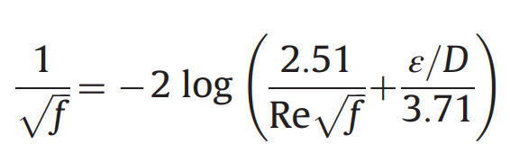
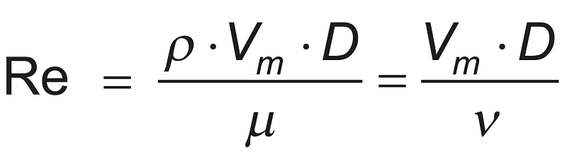
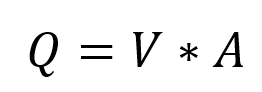

# Estructuras de Control: Bucles

Los bucles o ciclos, son herramientas de contro, que permiten repetir un fragmento de código bajo el cumplimiento de una condición, los bucles nos permiten tener eficiencia en tareas reincidentes o iterativas.

En el curso revisaremos dos tipos de estructuras de control

## For

`For` nos permite repetir un conjunto de órdenes un numero establecido de veces a través de un índice irá recorriendo y ejecutanto el código que se encuentre dentro de las llaves.

Con un ejemplo simple veamos el funcionamiento de este bucle. Observe que dentro del paréntesis se ha colocado el contador (en el ejemplo lo llamamos `i`) y la condición del número finito de veces que se repita `1:10`, ahora en el corchete hemos colocado la instrucción `print(i)`es decir le hemos indicado que imprima el controlador. En el resultado observaremos que el controlador cada que se repetía el bucle incrementaba hasta llegar a 10

```{r}
for(i in 1:10){
  print(i)
}
```

Ahora veamos un ejempo aplicativo

Descargaremos de la bolsa el valor de las acciones de algunas empresas y resolveremos la pregunta: ¿ Cual es la empresa con mejor rendimiento? 

Entendiendo como rendimiento a: **precio_cierre/precio_apertura**

```{r, warning=FALSE, message=FALSE}
# Instalaremos el paquete "quantmod"
# Este paquete permite descargar valores de la bolsa
#install.packages("quantmod") #Descomentar para instalar
library(quantmod)
```

```{r}
# Obtengamos los valores para TSLA
start <- as.Date('2020-01-01') #Fecha de incio
# getSymbols es una función del paquete quantmod que permite descargar y guardar
TSLA <- getSymbols('TSLA',src='yahoo',from=start, auto.assign = F) 
head(TSLA)
```

```{r}
analizadas<- c('AMZN','AAPL','GOOG', 'TSLA', 'NFLX')
for(empresa in analizadas){ 
    data_empresas<-getSymbols(empresa,src='yahoo',from=start, to=Sys.Date(), auto.assign = F)
    df_empresas<- as.data.frame(data_empresas)
    precio_apertura<- df_empresas[1,1]
    precio_actual<- df_empresas[nrow(df_empresas),6]
    rendimiento<- precio_actual/precio_apertura}
rendimiento
```

¿De quíen es este rendimiento, es de la mejor empresa?

**NO** el resultado que obtuvimos es el rendimiento de la última empresa que analizó el bucle es decir de Netflix

Pero cómo hago que me devuelva no la última si no la mejor. Vamos a poner un condicional que evalue si el resultado anterior es mejor o peor que el anterior y así me determine el mejor de lo mejor.

```{r}
analizadas<- c('AMZN','AAPL','NFLX','GOOG', 'TSLA')

calcula_rendimiento<- function(empresas,fecha_inicio,fecha_fin=Sys.Date()){
  mejor_rendimiento<- -Inf
  mejor_empresa<- NA
  
  for(empresa in analizadas){ 
    data_empresas<-getSymbols(empresa,src='yahoo',from=fecha_inicio, to=fecha_fin, auto.assign = F)
    df_empresas<- as.data.frame(data_empresas)
    precio_apertura<- df_empresas[1,1]
    precio_actual<- df_empresas[nrow(df_empresas),6]
    rendimiento<- precio_actual/precio_apertura
    if(rendimiento>mejor_rendimiento){
      mejor_rendimiento<- rendimiento
      mejor_empresa<- empresa
    }}
  list(empresa=mejor_empresa,rendimiento =round((mejor_rendimiento)*100),2)
}
```

Ahora generemos resultados

¿Cuál es la empresa con mejor rendimiento del 2020?

```{r}
resul<- calcula_rendimiento(analizadas,fecha_inicio='2020-01-01',fecha_fin= '2020-12-31')
paste('La empresa con mejor rendimiento fue:'
      ,resul[['empresa']], 'y su rendimiento fue de'
      , resul[['rendimiento']],'%')
```

¿Cuál es la empresa con mejor rendimiento desde 2021 hasta la actualidad?

```{r}
resul_2<- calcula_rendimiento(analizadas,fecha_inicio='2021-01-01')
paste('La empresa con mejor rendimiento fue:'
      ,resul_2[['empresa']], 'y su rendimiento fue de'
      , resul_2[['rendimiento']],'%')
```

## While

Este es un tipo de bucle que ocurre mientras una condición es verdadera `TRUE` 

Hagamos un ejercicio mientras aprendemos varias cosas extra

Respondamos las pregunta: **¿ Cúantas iteraciones debemos hacer hasta obtener un número menor a 5?** 
Dentro de R podemos trabajar con varias distribuciones, con la función r acompañada del nombre de la distribución podemos generar valores aleatorios, el primer argumento de la función `runif()` es cuantos números queremos generar, el segundo es el valor mínimo del número aleatorio,  y el tercer argumento, el valor máximo.

```{r}
val<- 1 # Observe que estamos declarando una variable previamente al incio del bucle 
while(val<5){
  val<-runif(1,min = 0,max = 10)  
  print(val)
}
```

Ahora que ya hemos entendido el funcionamiento del bucle **While** hagamos un ejemplo:

Determine el factor de fricción, mediante la ecuación de Colebrook White, para una tubería de PVC de 250 mm por el que transita un caudal de 55 l/s

Les colocaré todas las ecuaciones necesarias 

```{r friccion, echo = FALSE, out.width = "50%", fig.align = "center", fig.asp=.75,fig.cap='Ecuación de Colebrook White'} 

```

```{r reynolds, echo = FALSE, out.width = "50%", fig.align = "center", fig.asp=.75,fig.cap='Número de Reynolds'} 

```

```{r continuidad, echo = FALSE, out.width = "50%", fig.align = "center", fig.asp=.75,fig.cap='Ecuación de la Continuidad'} 

```

```{r}
# Datos

Q<- 0.055 # Caudal
D<- 0.25 # Diámetro
e<- 0.0000015 # Rugosidad absoluta
vis<- 1.007*(10^-6) # Viscosidad
A<- (pi*(D^2))/4 # Área
Re<- ((Q/A)*D)/vis #Número de Reynolds

#Controladores
f<- 1
f_anterior<- 0.02
f_nuevo<- 0.01

while(f != f_nuevo){ 
  f_nuevo<- (1/(-2*log10(((e/D)/3.71)+(2.5/(Re*sqrt(f_anterior))))))^2
  if(f_nuevo == f_anterior){ f<- f_nuevo} else{ 
    f_anterior<- f_nuevo
    }
}
f
```

## 📝 Ejercicio

1. Para un canal abierto rectangular de PVC (e = 0.0015x10-3). La profundidad del flujo uniforme es 0.5 m con un ancho de 10 m y pendiente de 0.000035. **Calcular el caudal que transita**

En la carpeta documentos puede encontrar el ejercicio resuelto para que le sirva como guía de programación.
