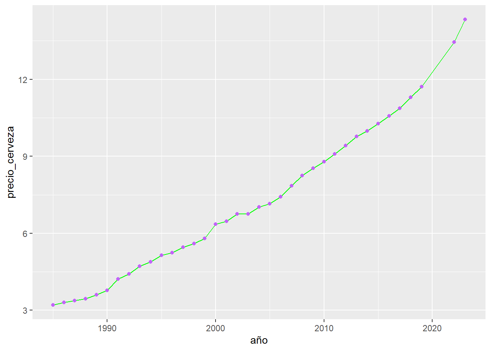
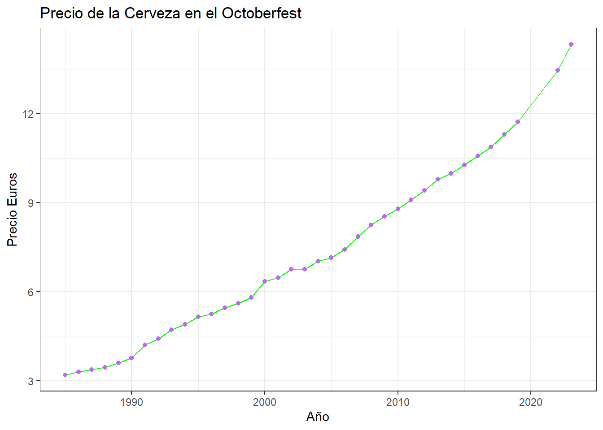
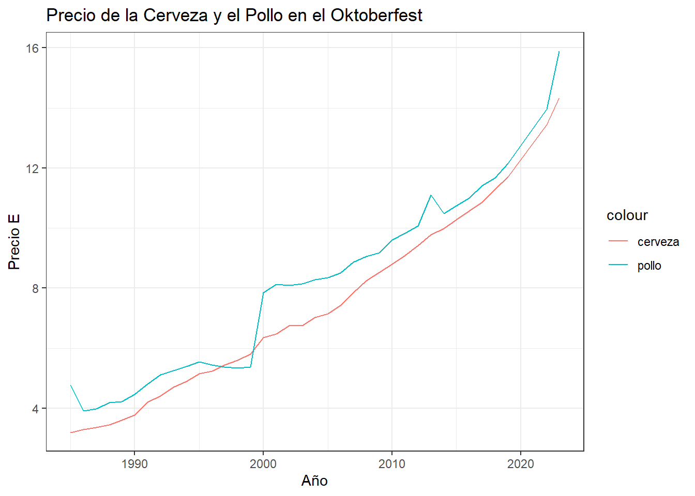
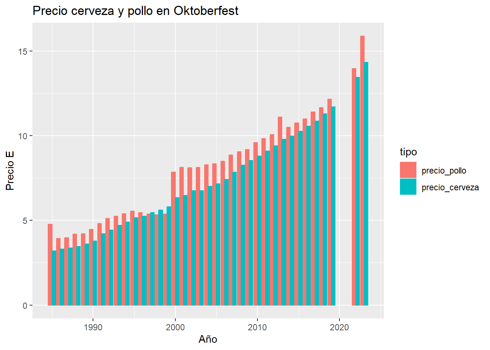
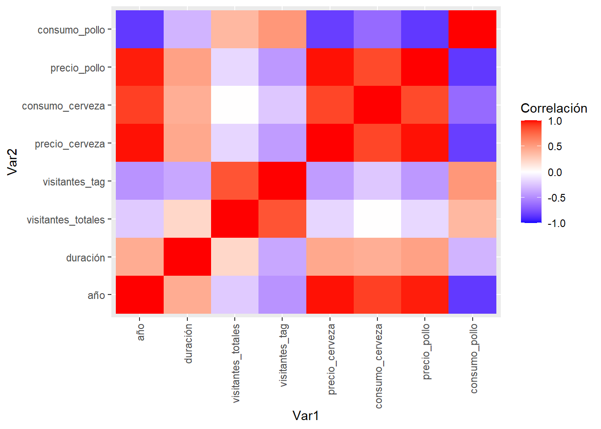

# Gráficos con ggplot 2

El diseño de gráficos es un capítulo muy extenso que requiere mucha práctica, sin embargo no es complejo de comprender. Utilizaremos el paquete `ggplot2` para construir gráficos.

**ggplot2** es un sistema para crear gráficos de forma declarativa es decir grafica a través de instrucciones

Para el ejemplo utilizaremos la data generada por los organizadores del Octoberfest con respecto al consumo y precios a lo largo de los años de la cerveza y el pollo vendido en el festival.


``` r
# Descargaremos la data del portal de datos abiertos de Múchin
url_oktoberfest<- "https://opendata.muenchen.de/dataset/8d6c8251-7956-4f92-8c96-f79106aab828/resource/e0f664cf-6dd9-4743-bd2b-81a8b18bd1d2/download/oktoberfestgesamt19852022.csv"
df_oktoberfest<- read.csv(url_oktoberfest)
colnames(df_oktoberfest)<-c('año','duración','visitantes_totales',
                            'visitantes_tag','precio_cerveza',
                            'consumo_cerveza',
                            'precio_pollo','consumo_pollo')
summary(df_oktoberfest)
#>       año          duración     visitantes_totales
#>  Min.   :1985   Min.   :16.00   Min.   :5.500     
#>  1st Qu.:1994   1st Qu.:16.00   1st Qu.:6.000     
#>  Median :2003   Median :16.00   Median :6.400     
#>  Mean   :2003   Mean   :16.35   Mean   :6.322     
#>  3rd Qu.:2012   3rd Qu.:16.00   3rd Qu.:6.500     
#>  Max.   :2023   Max.   :18.00   Max.   :7.200     
#>  visitantes_tag  precio_cerveza  consumo_cerveza
#>  Min.   :329.0   Min.   : 3.20   Min.   :48698  
#>  1st Qu.:369.0   1st Qu.: 4.89   1st Qu.:53807  
#>  Median :394.0   Median : 6.75   Median :61772  
#>  Mean   :387.1   Mean   : 7.25   Mean   :62799  
#>  3rd Qu.:406.0   3rd Qu.: 9.41   3rd Qu.:71340  
#>  Max.   :444.0   Max.   :14.33   Max.   :79225  
#>   precio_pollo    consumo_pollo   
#>  Min.   : 3.920   Min.   :313636  
#>  1st Qu.: 5.340   1st Qu.:479610  
#>  Median : 8.140   Median :509420  
#>  Mean   : 7.988   Mean   :560189  
#>  3rd Qu.:10.070   3rd Qu.:681242  
#>  Max.   :15.890   Max.   :807710
```

Figémonos en la estructura principal del gráfico:

* El primer atributo corresponde al data frame de donde se obtendrá la información
* El segundo atributo es **aes()** que permite seleccionar las variables a graficar y como presentarlas (a qué eje corresponden)

Con los atributos listos ya podemos empezar a agregar capas para formar un gráfico cada vez más complejo.

En el ejemplo relacionaremos el año con el precio de la cerveza e incluiremos dos tipos de gráfico, uno de puntos y uno lineal, para crear un gráfico de puntos hemos colocado **geom_point** y además hemos agregado un color con un código hexagesima, para el gráfico de línea agregamos **geom_line** y el color en palabras.


``` r
# Instalaremos y llamaremos a la librería ggplot2
# install.packages("ggplot2") #Descomentar para instalar
library(ggplot2)
ggplot(df_oktoberfest,aes(x=año,y=precio_cerveza))+geom_line(color='green')+
  geom_point(color='#c263f9')
```



Al código anteiror le incluiremos títulos a los ejes, título al gráfico y un tema. Los títulos de los ejes los agregamos con `xlab()`o `ylab()` y el título del gráfico con `ggtitle()`. Finalmente el tema aplicado será `theme_bw()` que quita el fondo gris por defecto del gráfico.


``` r
ggplot(df_oktoberfest,aes(x=año,y=precio_cerveza))+geom_line(color='green')+
  geom_point(color='#c263f9')+
  xlab("Año") + ylab("Precio Euros") + ggtitle("Precio de la Cerveza en el Octoberfest")+
  theme_bw()
```



Ahora grafiquemos en el mismo gráfico el precio del pollo y el precio de la cerveza a lo largo de los años


``` r
ggplot(df_oktoberfest,aes(x=año))+
         geom_line(aes(y=precio_cerveza,color='cerveza'))+
         geom_line(aes(y=precio_pollo,color='pollo'))+
         xlab("Año") + ylab('Precio E') + ggtitle('Precio de la Cerveza y el Pollo en el Oktoberfest')+
  theme_bw()
```



Observe que ahora en el aes solo tenemos asignado x = año ya que es la variable en común, y en cada uno de los gráficos declaramos el eje "y", además estamos indicando que asigne un color a la cervez y un color al pollo.

Para nuestro siguiente gráfico vamos a instalar el paquete `reshape2` y ocuparemos la función `melt()` que permite reorganizar y resumir. 

* El primer argumento corresponde al data frame de donde se obtendrá la información
* `id.vars()` corresponde a la variable de identificación
* `measure.vars()` son las variables de organización


``` r
# Instalaremos y llamaremos a la librería ggplot2
# install.packages("reshape2") #Descomentar para instalar
library(reshape2)
df_melted<- melt(df_oktoberfest,id.vars=('año'),
                 measure.vars=c('precio_pollo','precio_cerveza'),
                 variable.name='tipo',value.name = 'precio')
head(df_melted)
#>    año         tipo precio
#> 1 1985 precio_pollo   4.77
#> 2 1986 precio_pollo   3.92
#> 3 1987 precio_pollo   3.98
#> 4 1988 precio_pollo   4.19
#> 5 1989 precio_pollo   4.22
#> 6 1990 precio_pollo   4.47
tail(df_melted)
#>     año           tipo precio
#> 69 2016 precio_cerveza  10.57
#> 70 2017 precio_cerveza  10.87
#> 71 2018 precio_cerveza  11.30
#> 72 2019 precio_cerveza  11.71
#> 73 2022 precio_cerveza  13.45
#> 74 2023 precio_cerveza  14.33
```

Grafiquemos un diagrama de barras que represente tanto el precio de la cerveza como el del pollo. En aes (contenido estético) hemos colocado el año como variable independiente y el precio como varible dependiente. Mire que para graficar columnas tenemos `geom_col()` y en position = 'dodge' es decir que las columnas se graficarán sin espacio entre sí


``` r
ggplot(df_melted,aes(x=año, y=precio, color=tipo))+
  geom_col(position = 'dodge',aes(fill=tipo))+
  ylab("Precio E") + xlab("Año") + ggtitle("Precio cerveza y pollo en Oktoberfest")
```



Finalmente haremos un grafico de correlación

Primero con la función `cor()` generaremos correlaciones entre las variables del data frame 


``` r
cr_oktoberfest<- cor(df_oktoberfest)
cr_oktoberfest
#>                           año   duración visitantes_totales
#> año                 1.0000000  0.4315849       -0.224676225
#> duración            0.4315849  1.0000000        0.207551671
#> visitantes_totales -0.2246762  0.2075517        1.000000000
#> visitantes_tag     -0.4644614 -0.3798716        0.825457655
#> precio_cerveza      0.9873733  0.4514158       -0.172881811
#> consumo_cerveza     0.8918055  0.4178338        0.003398335
#> precio_pollo        0.9720990  0.4861828       -0.167548583
#> consumo_pollo      -0.8497377 -0.3206961        0.369291773
#>                    visitantes_tag precio_cerveza
#> año                    -0.4644614      0.9873733
#> duración               -0.3798716      0.4514158
#> visitantes_totales      0.8254577     -0.1728818
#> visitantes_tag          1.0000000     -0.4275875
#> precio_cerveza         -0.4275875      1.0000000
#> consumo_cerveza        -0.2391642      0.8732945
#> precio_pollo           -0.4438951      0.9870883
#> consumo_pollo           0.5353060     -0.8306472
#>                    consumo_cerveza precio_pollo
#> año                    0.891805498    0.9720990
#> duración               0.417833780    0.4861828
#> visitantes_totales     0.003398335   -0.1675486
#> visitantes_tag        -0.239164239   -0.4438951
#> precio_cerveza         0.873294471    0.9870883
#> consumo_cerveza        1.000000000    0.8617829
#> precio_pollo           0.861782943    1.0000000
#> consumo_pollo         -0.645371093   -0.8529126
#>                    consumo_pollo
#> año                   -0.8497377
#> duración              -0.3206961
#> visitantes_totales     0.3692918
#> visitantes_tag         0.5353060
#> precio_cerveza        -0.8306472
#> consumo_cerveza       -0.6453711
#> precio_pollo          -0.8529126
#> consumo_pollo          1.0000000
```

Ahora organizaremos la data en dos variables que combinen las variables entre ellas. Observa estamos utilizando la función `melt()`


``` r
library(reshape2)
mlt_cor_oktober<- melt(cr_oktoberfest)
tail(mlt_cor_oktober)
#>                  Var1          Var2      value
#> 59 visitantes_totales consumo_pollo  0.3692918
#> 60     visitantes_tag consumo_pollo  0.5353060
#> 61     precio_cerveza consumo_pollo -0.8306472
#> 62    consumo_cerveza consumo_pollo -0.6453711
#> 63       precio_pollo consumo_pollo -0.8529126
#> 64      consumo_pollo consumo_pollo  1.0000000
```

Generemos el gráfico correlacional. Las variables serán la columna Var1 y la columna Var2 del data frame organizado, recuerda que en las dos columnas hay los mismo parámetro; además hemos colocado un color de relleno `fill()` que dependerá del valor de la correlación. 
En este gráfico hemos configurado la escala con la función `scale_fill_gradient2()` en donde definimos el color que representa una correlación alta, media y baja, además de los límites correlacionales. 


``` r
ggplot(data=mlt_cor_oktober,aes(x= Var1, y =Var2, fill= value))+
  scale_fill_gradient2(low = 'blue',high ='red',mid = 'white',midpoint = 0,limit=c(-1,1),
                       name= "Correlación")+ 
  geom_tile()+
  guides(x = guide_axis(angle = 90))
```


