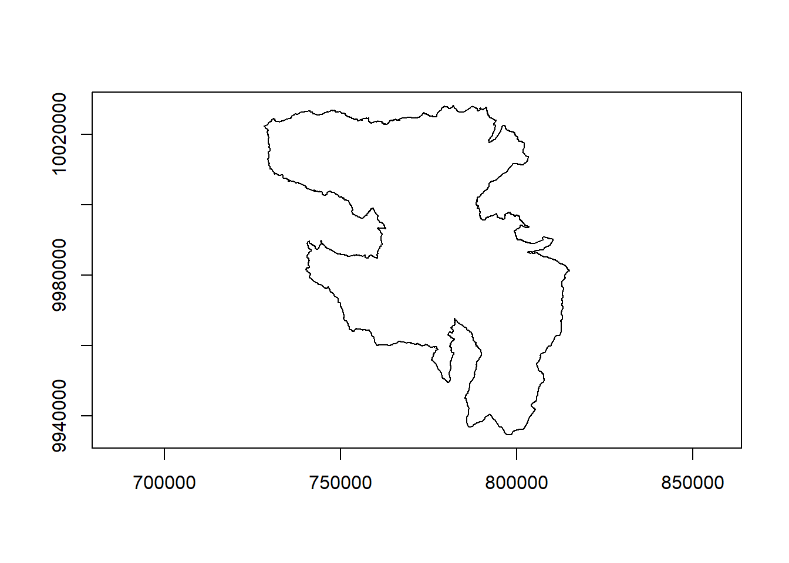
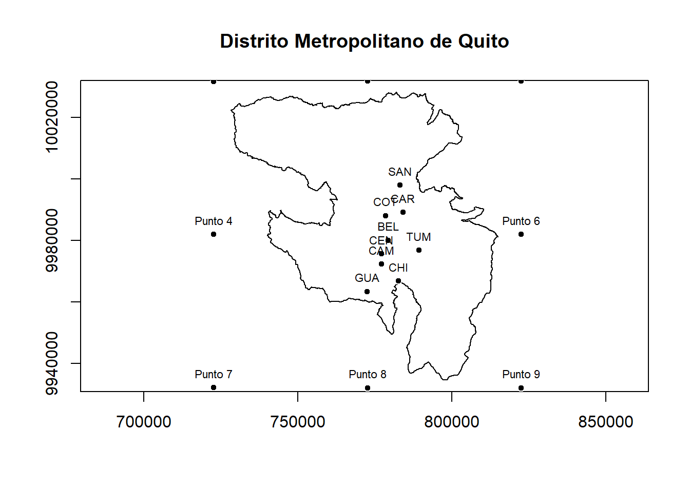
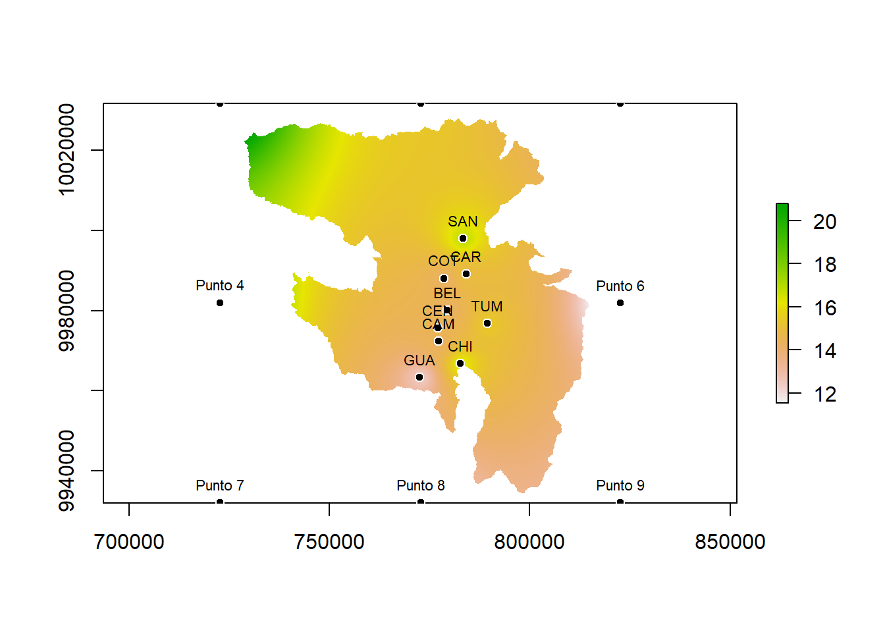
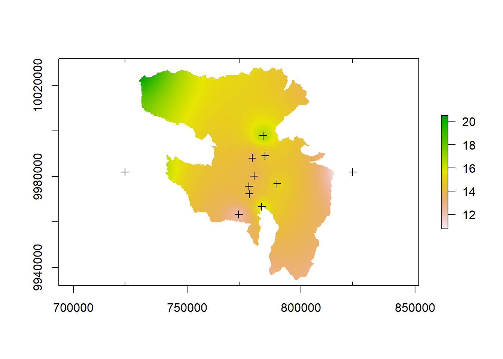

# (PART) Geoestadística {-}

# Interpolación - método IDW

## Antes de empezar

Durante el procedimiento de interpolación ocuparemos varias librerías que dejaremos cargadas.


``` r
library(gstat)
library(raster)
#> Loading required package: sp
library(sp)
library(writexl)
library(dplyr)
#> 
#> Attaching package: 'dplyr'
#> The following objects are masked from 'package:raster':
#> 
#>     intersect, select, union
#> The following objects are masked from 'package:stats':
#> 
#>     filter, lag
#> The following objects are masked from 'package:base':
#> 
#>     intersect, setdiff, setequal, union
```

Antes de empezar cualquier proceso que requiera un sistema de referencia de coordenadas para trabajar, es necesario y muy importante definir este sistema que utilizaremos para nuestro análisis.  Es crucial que todos los recursos y datos estén en el mismo sistema de referencia para asegurar la coherencia y precisión en el análisis. Si los datos provienen de diferentes fuentes y tienen sistemas de referencia distintos, es necesario transformarlos al sistema de referencia común. En esta ocación se empleará el sistema de coordenadas UTM. 

En la línea de codigo que veremos a continuación, únicamente estamos almacenando en una variable el sistema de coordenadas con el que trabajaremos durante el proyecto; tenerlo como una variable nos ahorrará mucho tiempo de escritura cada vez que lo necesitemos.


``` r
utm17s <- "+proj=utm +zone=17 +south +datum=WGS84 +units=m +no_defs"
```

En el ejemplo a trabajar cargaremos un archivo tipo vector **.shp**  correspondiente al área del Distrito Metropolitano de Quito, que nos permitirá estar ubicados en espacio.


``` r
DMQ<-shapefile("./documentos/DATOS/DMQ_arc/limite_dmq.shp")

print(DMQ) # Nos mostrará la información del shapefile
#> class       : SpatialPolygonsDataFrame 
#> features    : 1 
#> extent      : 450069.9, 536741.5, 9934660, 10028268  (xmin, xmax, ymin, ymax)
#> crs         : +proj=tmerc +lat_0=0 +lon_0=-78.5 +k=1.0004584 +x_0=500000 +y_0=10000000 +datum=WGS84 +units=m +no_defs 
#> variables   : 1
#> names       :         NOMBRE 
#> value       : limite del DMQ
```

Observemos que el CRS (Sistema de referencia de coordenadas) no corresponde a UTM, por lo que será necesario cambiar de sistema al que hemos establecido como CRS del proyecto.

Al cargar un archivo vectorial a `R` este se convierte un tipo de dato llamado **SpatialPointsDataFrame** por lo que es necesario asignarle un sistema de coordenadas, sin embargo debe asignarse el mismo sistema de coordenadas de origen y posteriormente transformar el sistema.

*  `proj4string()` <- `CRS()` asigna un sistema de coordenadas proyectadas al data frame 

* mientras que `spTransform()` permite el cambio de sistema de coordenadas


``` r
original_crs <- CRS("+proj=tmerc +lat_0=0 +lon_0=-78.5 +k=1.0004584 +x_0=500000 +y_0=10000000 +datum=WGS84 +units=m +no_defs")
proj4string(DMQ) <- original_crs
DMQ <- spTransform(DMQ, CRS(utm17s))
plot(DMQ, axes=TRUE)
```




## Interpolación IDW

La data que utilizaremos para realizar este ejemplo de interpolación corresponde a temperatura media mensual de 9 estaciones pertenecientes a la Red Metropolitana de Monitoreo Atmosférico de Quito y 8 puntos de datos de la base ERA5. 
La data se encuentra en formato csv y debe incluir coordenadas geográficas junto con la información que se desea interpolar.

Observe por favor que en esta ocación estamos usando el comando `read.csv2()`, hemos realizado esta pequeña variación ya que `read.csv()` lee archivos CSV donde los valores están separados por comas y `read.csv2()` lee archivos CSV donde los valores están separados por punto y coma


``` r
TMP.XY <- read.csv2("./documentos/DATOS/TMP.csv",sep =";")
head(TMP.XY)
#>   ESTACION  ALT    LON     LAT      ENE      FEB      MAR
#> 1      BEL 2797 779400 9980085 14.23673 14.26562 13.80180
#> 2      CAR 2659 784166 9989120 14.95924 14.96538 14.72410
#> 3      CEN 2820 777160 9975660 14.51384 14.53692 14.17645
#> 4      COT 2752 778596 9988076 14.20713 14.22295 14.01523
#> 5      CAM 2922 777171 9972341 14.30878 14.40736 14.07245
#> 6      GUA 3047 772559 9963399 12.46508 12.56331 12.19916
#>        ABR      MAY      JUN      JUL      AGO      SEP
#> 1 14.07283 14.38742 13.97779 14.06035 14.27666 14.26440
#> 2 14.97188 15.11339 14.76750 14.79881 15.06350 14.99567
#> 3 14.43631 14.79578 14.34138 14.50590 14.70644 14.64899
#> 4 14.28403 14.44142 14.05678 14.05837 14.34585 14.19951
#> 5 14.28144 14.69704 14.21836 14.32308 14.47795 14.41738
#> 6 12.35128 12.64246 12.19130 12.15143 12.35342 12.43739
#>        OCT      NOV      DIC
#> 1 13.83736 13.72376 14.10633
#> 2 14.70503 14.66559 14.82405
#> 3 14.15520 14.14233 14.33171
#> 4 13.91050 13.92557 14.14147
#> 5 13.96736 13.85475 14.13327
#> 6 12.09178 12.10770 12.29634
```

* `coordinates()` convierte un data frame regular (TMP) en un objeto espacial del tipo SpatialPointsDataFrame al asignarle coordenadas espaciales.


``` r
coordinates(TMP.XY) <- ~LON+LAT
proj4string(TMP.XY) <- CRS(utm17s)
```

Una vez que todos nuestros datos estén en el mismo sistema de referencia, resulta sencillo generar gráficos que combinan tanto las estaciones como el contorno del Distrito Metropolitano de Quito (DMQ). La homogeneidad en el sistema de referencia facilita la superposición de las capas de datos.


``` r
plot(DMQ, axes=TRUE, main="Distrito Metropolitano de Quito")
plot(TMP.XY, col="white", pch=21, add=TRUE)
text(coordinates(TMP.XY), labels=TMP.XY$ESTACION, pos=3, cex=0.7, col="black")
```



Para realizar la interpolación es necesario hacer una **grilla de predicción**, que será una malla regular a partir del objeto SpatialPointsDataFrame TMP.XY y servirá como dominio (base) sobre el cual se realizará la interpolación. En este caso, se utiliza un tamaño de celda de 100 unidades para la malla.


``` r
grilla = spsample(TMP.XY, type = "regular", cellsize = c(100,100))
class(grilla) #Verificamos el tipo de dato
#> [1] "SpatialPoints"
#> attr(,"package")
#> [1] "sp"
gridded(grilla) = TRUE #Verifica si se encuentra cuadriculado
```

¡Ahora si vamos a interpolar! 

La función `idw()` utiliza el método IDW para interpolar los valores, en este caso interpolará la columna ENE, que corresponde a los datos de temperatura mensual miltianual del mes de Enero, la interpolación se hará sobre una grilla de puntos definida (grilla), basada en las estaciones contenidas en TMP.XY. ENE **~ 1**  indica que se está interpolando una variable sin efectos dependientes adicionales.

* `raster()` Convierte el resultado de la interpolación IDW a un objeto raster.
* el comando `raster()` tiene varias funcionalidades, puede ayudarnos a cargar archivos tipo **.tif** pero también a convertirlos a este formato, esta última es nuestra necesidad
* finalmente `mask()` permite cortar un archivo tipo **.tif** a partir de uno tipo **.shp**


``` r

IDW.TMP.ENE <- idw(ENE~ 1, TMP.XY, grilla)
#> [inverse distance weighted interpolation]
IDW.TMP.ENE <- raster(IDW.TMP.ENE)
IDW.TMP.ENE <- mask(IDW.TMP.ENE, DMQ)
plot(IDW.TMP.ENE)
plot(TMP.XY, col="white", pch=21, add=TRUE)
text(coordinates(TMP.XY), labels=TMP.XY$ESTACION, pos=3, cex=0.7, col="black")
```



Ahora supongamos, que es el caso más esperado, no solo necesitamos realizar la interpolación de un mes, sino de todo el año. El uso de un bucle FOR (aunque recuerde puede usar un apply para ser más eficiente) en la interpolación puede ser extremadamente útil. Este enfoque automatiza el proceso de interpolación, permitiendo aplicar el mismo método de manera repetitiva a diferentes subconjuntos de datos sin necesidad de hacerlo manualmente para cada uno.

Recordemos que antes un bucle, sobre todo si deseo almacenar los datos debo declara una variable vacía, en este caso será una lista vacía.


``` r
IDW.TMP_rasters <- list()
```

Ahora repitamos el proceso de interpolación para todos los meses


``` r
for (mes in c("ENE", "FEB", "MAR", "ABR", "MAY", "JUN", "JUL", "AGO", "SEP", "OCT", "NOV", "DIC")) {
  
  # IDW
  
  IDW.TMP <- idw(as.formula(paste(mes, "~ 1")), TMP.XY, grilla)
  IDW.TMP <- raster(IDW.TMP)
  IDW.TMP <- mask(IDW.TMP, DMQ)
  
  # Guardar el raster en la lista
  
  IDW.TMP_rasters[[mes]] <- IDW.TMP
}
#> [inverse distance weighted interpolation]
#> [inverse distance weighted interpolation]
#> [inverse distance weighted interpolation]
#> [inverse distance weighted interpolation]
#> [inverse distance weighted interpolation]
#> [inverse distance weighted interpolation]
#> [inverse distance weighted interpolation]
#> [inverse distance weighted interpolation]
#> [inverse distance weighted interpolation]
#> [inverse distance weighted interpolation]
#> [inverse distance weighted interpolation]
#> [inverse distance weighted interpolation]
```

Grafiquemos solo un mes


``` r
plot(IDW.TMP_rasters$JUN)
plot(TMP.XY, add=TRUE)
```



### Exportando datos

La capacidad de exportar raster permite que los resultados de las interpolaciones sean utilizados y visualizados en diversas aplicaciones de SIG, de esta manera, se facilita la integración y comparación de datos con otros conjuntos de información espacial y se pueden realizar análisis adicionales con herramientas avanzadas.

La primera parte de este apartado nos permitirá crear una carpeta desde `R` para almacenar los resultados, por lo que no es primordial, pero es buena práctica.

* `getwd()` Obtiene el directorio de trabajo actual
* `file.path()` Crea la ruta completa de un archivo, uniendo lo que se encuentre en el argumento, en este caso directorio y nombre de la carpeta


``` r

DIRECTORIO <- getwd()
folder_name <- "IDW_TMP_Rasters" # Definimos el nombre de la carpeta que se desea crear
#folder_TMP <- file.path(DIRECTORIO, folder_name)

# para mi caso en específico (subir mis archivos a la web) no utilizaré la dirección del directorio

folder_TMP<- file.path(".",folder_name)

# Verifica si hay un carpeta con ese nombre, sino, crea la carpeta

if (!dir.exists(folder_TMP)) {
  dir.create(folder_TMP, recursive = TRUE)
}
```

Ahora exportemos los raster de interpolación en formato GeoTIFF


``` r

for (mes in names(IDW.TMP_rasters)) {
  
  output_filename <- file.path(folder_TMP, paste0("IDW_TMP_", mes, ".tif"))
  
  writeRaster(IDW.TMP_rasters[[mes]], filename = output_filename, format = "GTiff", overwrite=TRUE)
}
```
