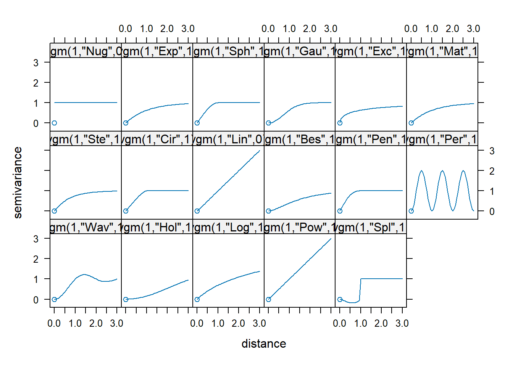

# Interpolación - método Kriging Ordinario


Kriging es un método de inferencia espacial, el cual nos permite estimar los valores de una variable en lugares no muestreados utilizando la información proporcionada por la muestra.En este capítulo aplicaremos el método de Kriging Ordinario, por lo que no depende de ninguna variable externa y se considera que la media de los datos es constante en todo el dominio, por tanto, usamos la fórmula VARIABLE A INTERPOLAR ~ 1

La metodología geoestadística no comienza en la estimación espacial o en la determinación del semivariograma, existen etapas prelimiares que son fundamentales para el análisis

## 1. Análisis preliminar 

Esta eptapa consiste en determinar el área a interpolar siempre recordando que estos porcesos no funcionan en extrapolación.

## 2. Análisis exploratorio de los datos

La segunda etapa consiste en caraterizar estadísticamente la muestra.
Recordemos que cuando la variable aleatoria sigue una distribución normal los resultados de interpolación obtenidos con Kriging son mejores. 
Por lo que si **la distribución no es simétrica** se trabajará con el logaritmo de los datos.

Determinemos si la distribución de los datos que tenemos está distribuida simetricamente o no


``` r
## Grafiquemos un histograma de los datos
library(gstat)
library(sp)
library(raster)
library(writexl)
library(dplyr)
#> 
#> Attaching package: 'dplyr'
#> The following objects are masked from 'package:raster':
#> 
#>     intersect, select, union
#> The following objects are masked from 'package:stats':
#> 
#>     filter, lag
#> The following objects are masked from 'package:base':
#> 
#>     intersect, setdiff, setequal, union
TMP.XY <- read.csv2("./documentos/DATOS/TMP.csv",sep =";")
coordinates(TMP.XY) <- ~LON+LAT
proj4string(TMP.XY) <- CRS("+proj=utm +zone=17 +south +datum=WGS84 +units=m +no_defs")
DMQ<-shapefile("./documentos/DATOS/DMQ_arc/limite_dmq.shp")
original_crs <- CRS("+proj=tmerc +lat_0=0 +lon_0=-78.5 +k=1.0004584 +x_0=500000 +y_0=10000000 +datum=WGS84 +units=m +no_defs")
proj4string(DMQ) <- original_crs
utm17s <- "+proj=utm +zone=17 +south +datum=WGS84 +units=m +no_defs"
DMQ <- spTransform(DMQ, CRS(utm17s))
#Histograma
hist(TMP.XY$ENE)
```


¿La distribución es simétrica? **No**, tendremos que trabajar con el logaritmo de nuestra data


``` r
hist(log(TMP.XY$ENE))
```


## Dependencia espacial y estimación del semivariograma experimental

La parte central de usar Kriging para interpolar datos espaciales es usar la primera ley de la Geografía: Todo está relacionado con todo, pero las cosas cercanas están más relacionadas que las cosas lejanas (Waldo Tobler). En este caso, de lo que se trata es de encontrar un límite a la dependencia espacial, es decir, ¿Qué tanto la medición en un lugar se parece a los de los lugares cercanos? y ¿Qué tan cerca es cerca?

Para resolver estas preguntas vamos a usar los variogramas, que representan una medida de cómo varia un campo como función de la distancia entre mediciones

<div>
<p style = 'text-align:center;'>
<iframe width="560" height="315"  
src="https://www.youtube.com/embed/SJLDlasDLEU" title="YouTube video player" frameborder="0" allow="accelerometer; autoplay; clipboard-write; encrypted-media; gyroscope; picture-in-picture; web-share" referrerpolicy="strict-origin-when-cross-origin" allowfullscreen></iframe>
</div>
</p>

Generemos el variograma 


``` r

TMP_ENE.ve.d <- variogram(log(ENE)~1, TMP.XY) 
plot(TMP_ENE.ve.d, pl = T, asp = 1)
```


``` r
TMP_ENE.ve.d
#>    np      dist        gamma dir.hor dir.ver   id
#> 1   3  4648.558 0.0005391867       0       0 var1
#> 2   4  8207.855 0.0037730629       0       0 var1
#> 3   9 11085.018 0.0082723204       0       0 var1
#> 4   6 14012.436 0.0046559570       0       0 var1
#> 5   4 17574.837 0.0057585889       0       0 var1
#> 6   2 21593.200 0.0160952120       0       0 var1
#> 7   3 22519.634 0.0058405426       0       0 var1
#> 8   3 26651.999 0.0125245741       0       0 var1
#> 9   2 31236.805 0.0040526438       0       0 var1
#> 10  1 33540.489 0.1031849104       0       0 var1
#> 11  3 35898.470 0.0416461451       0       0 var1
#> 12  2 39775.018 0.0622895662       0       0 var1
#> 13  4 43012.082 0.0960088173       0       0 var1
#> 14  5 44965.064 0.0446283170       0       0 var1
```

En el variogramada hay dos ajustes que son de particular interés:  cutoff  y  width . El cutoff representa la distancia espacial máxima que se tiene en cuenta entre dos observaciones. El width es el intervalo de distancia sobre el que se calcula la semivarianza y podrían ser configurados.

## Variograma Teórico o Modelo de Variograma

El variograma experimental que calculamos en la sección anterior contiene información sobre la dependencia espacial de nuestros datos, sin embargo, para poder interpolar, necesitamos calcular la variable de interés en lugares en donde no se muestreó.

Observemos los diferentes modelos teóricos


``` r

show.vgms()
```



## Ajuste a Variograma 

Cualquier función que dependa de una distancia y una dirección no es necesariamente un semivariograma, esta es la razón por la que el semivariograma empírico no puede utilizarse directamente para realizar predicciones geoestadísticas. Por ello, a los valores semivariográficos estimados se les ajusta una función que represente un semivariograma válido.

Esta tarea, clave para el éxito del posterior proceso predictivo, no es sencilla ni existe consenso en torno a ella. El ajuste puede ser manual, utilizando métodos visuales y gráficos, o automático, que usa procedimientos estadísticos. Una combinación de ambos es muy recomendable.

Para un análisis visual se requiere establecer:

* **Sill** que corresponde al valor de la función cuando la distancia es mayor que el rango.
* **Rango** El valor de distancia a partir del cual ya no se observa dependencia espacial
* **Nugget** Si los puntos no empezaran desde el punto 0,0

Un ajuste automático puede realizarse a través de la función `fit.variogram`


``` r
TMP_ENE.vi.d <- vgm(nugget=0, model="Gau", range=sqrt(diff(TMP.XY@bbox["LON",])^2 + diff(TMP.XY@bbox["LAT",])^2)/4, psill=var(log(TMP.XY$ENE)))

plot(TMP_ENE.ve.d, pl=T, model=TMP_ENE.vi.d)
```


``` r
#Ajuste automático
TMP_ENE.vt.d <- fit.variogram(TMP_ENE.ve.d, model=TMP_ENE.vi.d)

plot(TMP_ENE.ve.d, pl = T, model = TMP_ENE.vt.d)
```


Para la interpolación utilizaremos el ajuste automático almacenado en **TMP_ENE.vt.d**

## Interpolación

Empezamos creando la grilla


``` r
grilla = spsample(TMP.XY, type = "regular", cellsize = c(100,100))
class(grilla) #Verificamos el tipo de dato
#> [1] "SpatialPoints"
#> attr(,"package")
#> [1] "sp"
gridded(grilla) = TRUE #Verifica si se encuentra cuadriculado
```


``` r
OK.TMP.ENE.LOG <- krige(log(ENE)~1, locations = TMP.XY, newdata = grilla, model = TMP_ENE.vt.d)
#> [using ordinary kriging]
```

La interpolación se realizó con éxito, obteniendo dos bandas:

* Una correspondiente a los valores interpolados

* La varianza, que indica la incertidumbre asociada a cada estimación.

Para recuperar los valores originales, se aplica una transformación exponencial a la banda de los valores interpolados. Aplicando la función exponencial a los resultados, se revierten estos valores a su escala original, permitiendo interpretarlos de manera correcta.


``` r

OK.TMP.ENE.LOG$ENE.pred <- exp(OK.TMP.ENE.LOG$var1.pred)

OK.TMP.ENE <- raster(OK.TMP.ENE.LOG, layer = "ENE.pred")
OK.TMP.ENE <- mask(OK.TMP.ENE, DMQ)
plot(OK.TMP.ENE, main = "Interpolación mediante Kriging Ordinario\n para el mes de enero\n Variable de Temperatura", col.regions = terrain.colors(100))
```


``` r

OK.TMP.ENE.VAR <- raster(OK.TMP.ENE.LOG, layer = "var1.var")
OK.TMP.ENE.VAR <- mask(OK.TMP.ENE.VAR, DMQ)
plot(OK.TMP.ENE.VAR)
plot(TMP.XY, add=TRUE)
```


Además de los valores interpolados, también es posible obtener un gráfico de la varianza, que es una medida de la incertidumbre asociada a las predicciones en cada punto del área de estudio. La varianza en el contexto de la interpolación, especialmente mediante Kriging, indica qué tan confiables son los valores estimados en diferentes ubicaciones.
