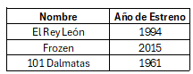

# Vectores

Hasta el momento hemos almacenado únicamete variables individuales. ¿Y si quisiéramos almacenar un conjunto de elementos?

Los vectores en `R` son objetos que tienen una sola dimensión, en donde se puede almacenar diferentes tipos de variables. 

Para crear un vector en `R` se utiliza el comando `c()` y cada elemento que pertenecerá a este conjuno se debe separar con `,`. Muchas veces será importante conocer la longitud total, tambien llamada dimensión del vector se utiliza el comando `length()`.


``` r
# Ceración de un vector con variables numéricas

v <- c(3,5,9) 

# Vamos a agregar nombres a las posiciones de los valores

v1 <- c(3,5,9,ancho = 2, largo = 7)

# ¿Cómo puedo imprimir un vector?

print(v) #Opción 1
#> [1] 3 5 9

(v1) #Opción 2
#>                   ancho largo 
#>     3     5     9     2     7

# Determinar la longitud o dimensión del vector

length(v)
#> [1] 3

length(v1)
#> [1] 5
```

Es muy importante poder acceder a los objetos creados. En este capítulo repasaremos cómo ponder visualizar y modificar los elementos de un vector. Hay que recordar que la posisicón de los elemento de un vector comienzan en 1 y que dentro del corchete se debe colocar la posición del elemento a ser encontrado. obteniendo como resultado el valor del objeto que ocupa la posición consultada


``` r
# Accederemos al primer elemento del vector llamado v1

v1[1]
#>   
#> 3

#También podemos eliminar elementos del vector

v[-2]
#> [1] 3 9
```

Sin embargo si yo intento buscar un elemento que está fuera de la longitud del vector, obtendré un `NA`


``` r
v[7]
#> [1] NA
```

Accederemos a una variable a través del nombre de que le asignamos a esta y la modificaremos


``` r
v1["largo"]
#> largo 
#>     7

v1["largo"]= 15
print(v1)
#>                   ancho largo 
#>     3     5     9     2    15
```

Finalmente obtendremos información a partir de variables lógicas


``` r
# Del vector v1 queremos saber los elementos que tiene asignado un valor mayor a 4 

v1 > 4
#>                   ancho largo 
#> FALSE  TRUE  TRUE FALSE  TRUE
```

Sin embargo no queremos conocer si la información es verdadera o falsa, queremos conocer el valor asigando a la respuesta verdadera 


``` r
mayor <- v1 > 4
v1[mayor]
#>             largo 
#>     5     9    15
```

Recuerda que los vectores no solo pueden contener variables numéricas, también podemos formar vectores con variables tipo caracter o variables lógicas. Ahora realizamos un ejercicio de práctica

## 📝 Ejercicio

* Cree tres vectores, uno que corresponda a los nombres de las películas de Disney más influyentes, en otro asigne puntuaciones y finalmente uno de tipo lógico según el año de estreno de la película, en donde si esta se estrenó posterior al 2007 sea **verdadero**, caso contrario **falso**

<div class="figure" style="text-align: center">

<p class="caption">(\#fig:ejercicio2)Películas de Disney</p>
</div>

1. Obtener el valor promedio de puntuaciones de las tres series, puede usar el comando `mean()`
2. Almacene en un vector el nombre de la película mejor puntuada y la peor puntuada
3. Almacene en un vector llamado **pelis_viejitas** las películas estrenadas antes del 2007, mediante variables lógicas
4. Elimine del vector que almacena los nombres de las películas el nombre de la película con menor puntaje.
